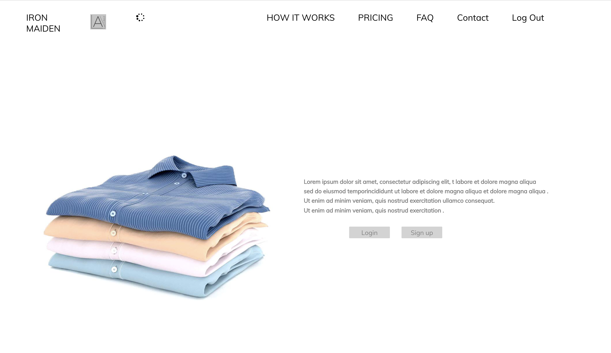
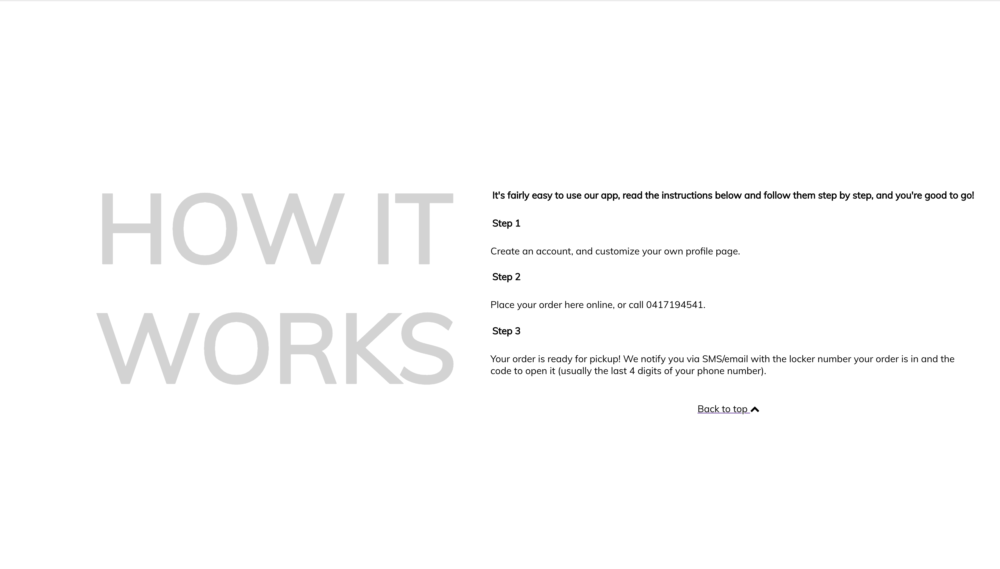
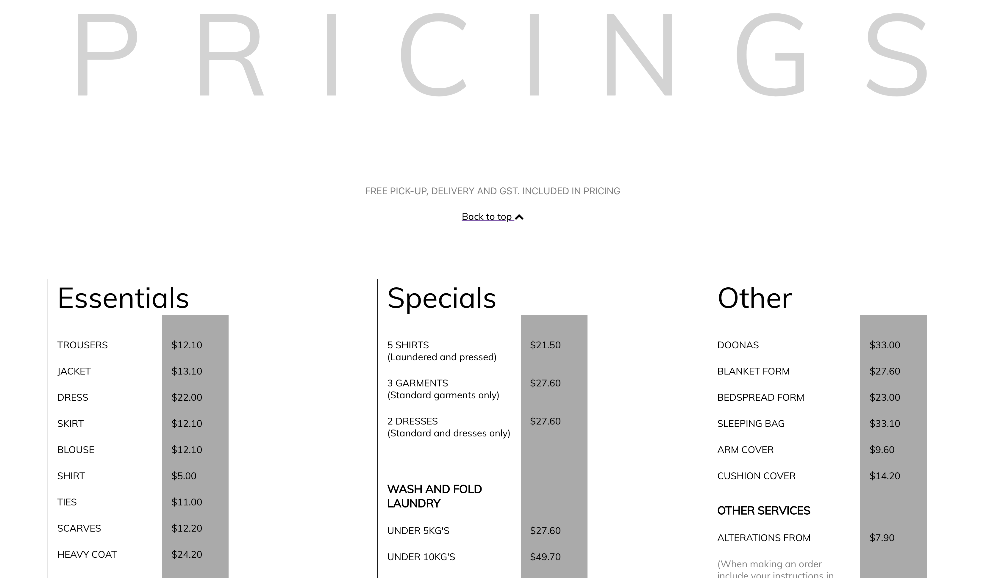
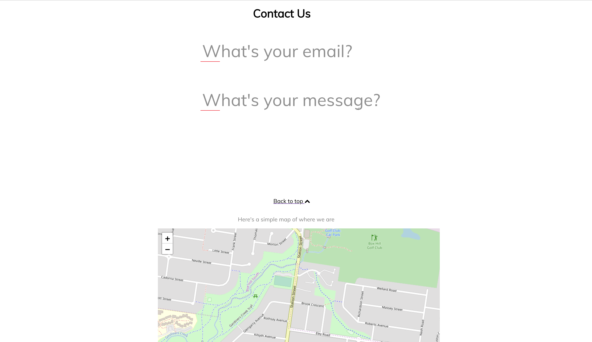
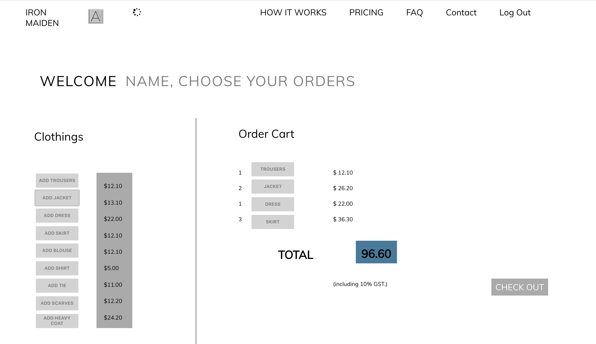
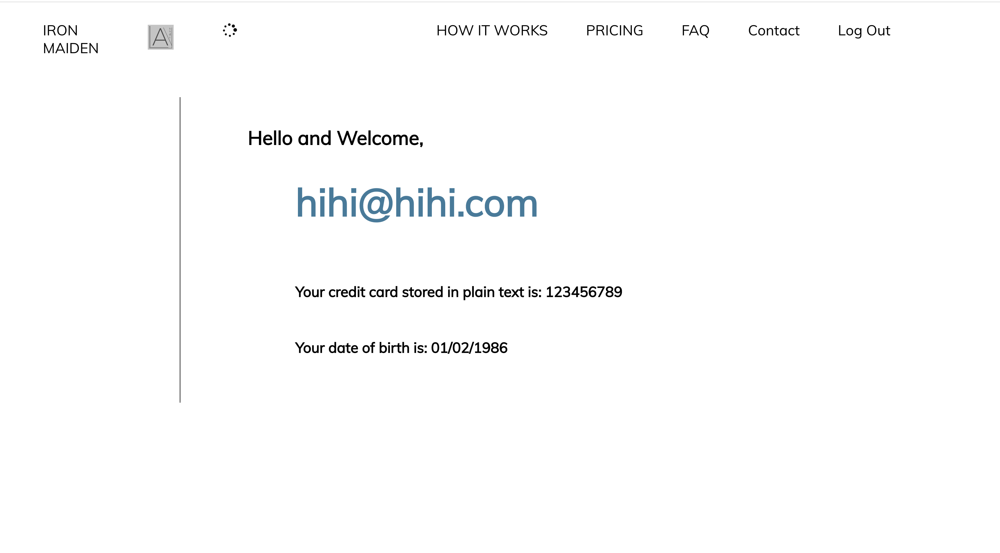

# IRON MAIDEN

## GitHub Repositories ##
[GithHub Repo Front-End](https://github.com/TridKay99/Breezy-Front-End)\
[GitHub Repo Back-End](https://github.com/alexanderb444/Breezy-Back-End)

## Deployed ##
[Live App](https://compassionate-saha-819100.netlify.com/)\
[BackEnd Deploy](https://breezy-back-end.tridkay90.now.sh/)

## Contents
<!-- links  -->
**[=> Section 1: Description](#Section-1:-Description)**

**[Overview](#Overview)**\
**[Group Members](#Contributors)**\
**[About](#About-Iron-Maiden)**\
**[Background](#Project-background)**\
**[Tech Stack](#Tech-Stack)**\
**[Configuration](#Configuration-/-Installation-Instructions)**\
**[Sitemap](#Sitemap)**\
**[Features](#Features)**\
**[Screenshots](#Screenshots)**\
**[Our Inspiration & The Idea](#Inspiration-/-Ideas)**

**[=> Section 2: Planning](#Section-2:-Planning)**

**[Project Plan](#Project-Plan)**\
**[Wireframes](#Wireframes)**\
**[ERD](#ERD-/-Database-Relationships)**\
**[User Journey Diagram](#User-Journey-Diagram)**\
**[Team Communication](#Team-Communication)**\
**[Task Management](#Task-Management)**\
**[Version / Source-Control](#Version-/-Source-Control)**

**[=> Section 3: Short Answer Questions](#Section-3:-Short-Answer-Questions)**

**[=> Section 4: Reflection](#Section-4:-Reflection)**

**[Challenges](#Challenges)**\
**[Take-Aways](#Take-Aways)**\
**[Extending-Coding-Tutor](#Extending-Breezy)**

**[=> Section 4: Section 5: Appendix](#Section-5:-Appendix)**
**[Single Page Scrolling](#Single-Page-Scrolling)**\
**[Search & Filtering](#Search-&-Filtering)**

---
## __Section 1: Description__

### __Overview__ ###
Iron Maiden is a service that allows users to log in and make an order to have their laundry pickedup and dropped off two days later.

This application is built using javascript and the MERN stack (**M**ongoDB, **E**xpress, **R**eact and **N**ode.js) for our final assignment at Coder Academy.

---

### __Contributors__ ###
Suet Er Lee\
Alex Bishop\
Tristan Kay

---

### __About Iron Maiden__ ###

Iron Maiden is a business that works in favour with the trend of the lazy world. As we indulged in the constant service of UberEats and Airtasker, people like me look towards applications to take care of other issues that my laziness intends to repent. 

With the simplicity of Iron Maiden, your laundry will simply be picked up from your address in Prahan or Richmond and delivered back to you after two days.\
i.e Richmind, pickup Monday and dropoff Wednesday.

### __Project Background__  

The aim was to find a real world client to represent and present a web application for a final assessment. A minimum of MVP required us to build a working prototype of the client concept and print it to a working deployed URL. Front-end deployed through Netlify and back-end deployed through Ziet Now.

Essentially, we needed to find a find an issue with our client's service and find a solution. Considering it had not yet been given a website, our solution was to create the website from scratch. This implements a user login system that uses a boolean (true or false) to determin whether the user was an Admin or normal user. This led into a a user profile that allowed them to place orders for their laundry.

### __Tech Stack__    

- Front-end: HTML, React, CSS, Sass, Javascript
- Back-end: Node.js, Javascript, Mongoose, Axios
- Database: Mongodb Database with Mongoose
- Deployment: Netlify for front-end, Up for back-end.

### __Configuration / Installation Instructions__

1) Within your CLI, navigate the directory where you want to install the application files, and run 'git clone https://github.com/TridKay99/Breezy-Front-End' and https://github.com/alexanderb444/Breezy-Back-End.

2) Run 'npm install' to install the dependencies

3) Run 'npx create-react-app filename' to use React for front end.

4) Run npm start to run the server in development mode

5) In your browser, navigate to 'http://localhost:3000/' to view the website

6) Either login using the default Guest Account:
  - email: guest@guest.com
  - password: password

7) Or Sign Up to create a new account

### __Site Map__

### __Features__

- Secure Login, User Authentication and Authorization
- Personalized User Profiles
- Admin Dashboard where admin can view their customer's orders, location, and total price
- Clear, well-organised and innovative UI with slimmed down content and features
- User orders where users can view list of orders and make changes
- Order Cart section to select clothings. Auto calculation for total price and a checkout system
- Log in and Sign up modals (pop ups)
- Checkout / payment using Credit Card with Strip Integration
- Contact form via mailgun
- Map of the location (Leaflet)

### __Screenshots__

\
\
\
\
\

### __Inspiration / Ideas__

We were inspired by the old webiste Breezy, http://www.breezy.com.au/

Other laundry websites :

### __Project Planning__

### __Wireframes__

### __ERD__

---

## User **Stories** && User **Journey** ##

### User Stories ###
Using figma, we created user stories where developed to give an example of a certain situation in which our product would work. A back an forth idea between the admin and user can be invisioned after the story is told.
Ultimately, gathered out of this can be the way our software features are used to help each perspective.

### __User Journey__

  - Tom (admin) is in the need of an application that allows him to view information from the admins side. He needs access to address', orders and the users that placed them.

  - Fred, Tristan, Nick (users) are in need of an application that will allow them to place an order(within reason). They need to supply their address and name to allow pickup and prove legitimact at times.

 

### __Team Communication__

### __Task Management__

## __Section 3: Short Answer Questions__

### 1) What are the most important aspects of quality software?

### 2) What libraries are being used in the app and why?

Many libraries are involved in the creation of this app including React, Node.js, axios, react-router-dom and mongoose.

__React__
React may be seen as a framework rather than a library, however many have argued that it is qualified as both.
React is a library for building composable user interfaces. It encourages the creation of reusable UI components which present data that changes over time.

__Node.js/NPM__
Node.js is also very popular due to its large ecosystem of libraries known as NPM modules. NPM stands for Node Package Manager. It is the largest software package library in the world, with over 600,000 packages.

__React-router-dom__
-- link
-- BrowserRouter
-- switch
-- Route

__Axios__
Axios is a very popular JavaScript library you can use to perform HTTP requests.

__Mongoose__
Mongoose (web server) Mongoose is a cross-platform embedded web server and networking library with functions including TCP, HTTP client and server, WebSocket client and server, MQTT client and broker and much more. The small size of the software enables any Internet-connected device to function as a web server.

### 3)  A team is about to engage in a project, developing a website for a small business. What knowledge and skills would they need in order to develop the project?

### 4)  Within your own project what knowledge or skills were required to complete your project, and overcome challenges?

Ans: project management skills

### 5)  Evaluate how effective your knowledge and skills were this project, using examples, and suggest changes or improvements for future projects of a similar nature?