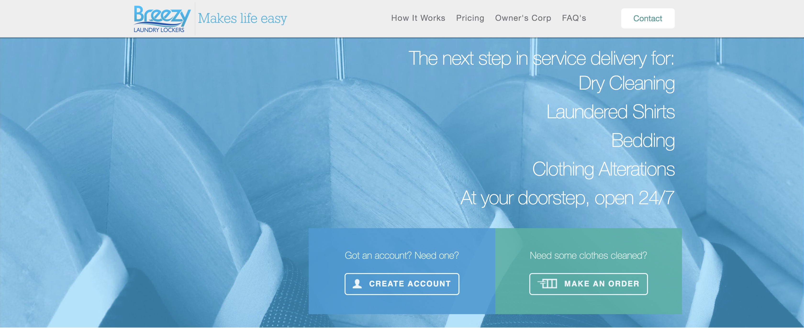
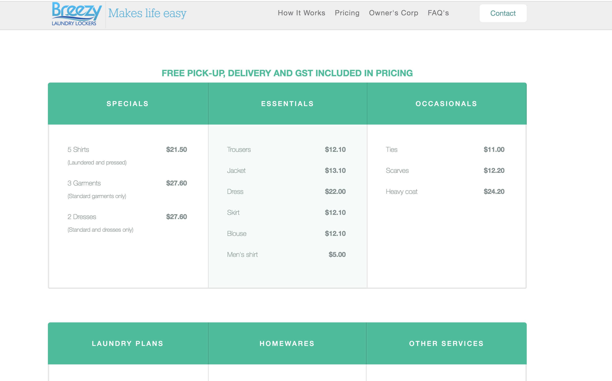
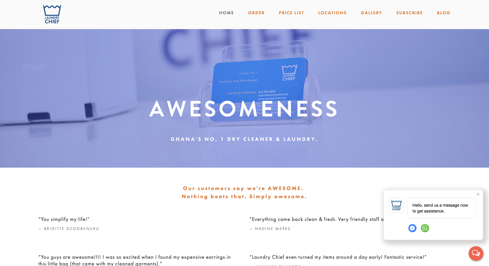
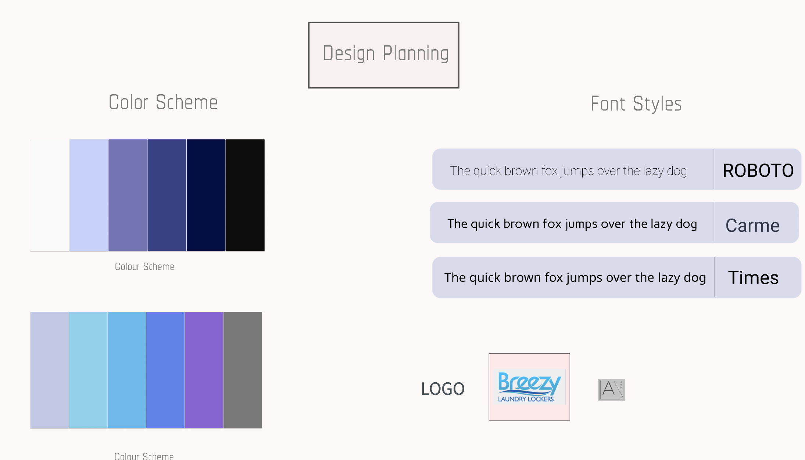

# IRON MAIDEN

## GitHub Repositories ##
[GithHub Repo Front-End](https://github.com/TridKay99/Breezy-Front-End)\
[GitHub Repo Back-End](https://github.com/alexanderb444/Breezy-Back-End)

## Deployed ##
[Live App](https://compassionate-saha-819100.netlify.com/)\
[BackEnd Deploy](https://breezy-back-end.tridkay90.now.sh/)

## Contents
<!-- links  -->
**[=> Section 1: Description](#Section-1:-Description)**

**[Overview](#Overview)**\
**[Group Members](#Contributors)**\
**[About](#About-Iron-Maiden)**\
**[Background](#Project-background)**\
**[Tech Stack](#Tech-Stack)**\
**[Configuration](#Configuration-/-Installation-Instructions)**\
**[Sitemap](#Sitemap)**\
**[Features](#Features)**\
**[Screenshots](#Screenshots)**\
**[Our Inspiration & The Idea](#Inspiration-/-Ideas)**

**[=> Section 2: Planning](#Section-2:-Planning)**

**[Project Plan](#Project-Plan)**\
**[Wireframes](#Wireframes)**\
**[ERD](#ERD-/-Database-Relationships)**\
**[User stories Diagram](#User-Stories)**\
**[User Journey Diagram](#User-Journey)**\
**[Team Communication](#Team-Communication)**\
**[Task Management](#Task-Management)**\
**[Version / Source-Control](#Version-/-Source-Control)**

**[=> Section 3: Short Answer Questions](#Section-3:-Short-Answer-Questions)**

**[=> Section 4: Reflection](#Section-4:-Reflection)**

**[Challenges](#Challenges)**\
**[Take-Aways](#Take-Aways)**\
**[Extending-Coding-Tutor](#Extending-Breezy)**

**[=> Section 4: Section 5: Appendix](#Section-5:-Appendix)**
**[Single Page Scrolling](#Single-Page-Scrolling)**\
**[Search & Filtering](#Search-&-Filtering)**

---
## __Section 1: Description__

### __Overview__ ###
Iron Maiden is a service that allows users to log in and make an order to have their laundry pickedup and dropped off two days later.

This application is built using javascript and the MERN stack (**M**ongoDB, **E**xpress, **R**eact and **N**ode.js) for our final assignment at Coder Academy.

---

### __Contributors__ ###
Suet Er Lee\
Alex Bishop\
Tristan Kay

---

### __About Iron Maiden__ ###

Iron Maiden is a business that works in favour with the trend of the lazy world. As we indulged in the constant service of UberEats and Airtasker, people like us look towards applications to take care of other issues that my laziness intends to repent. 

With the simplicity of Iron Maiden, your laundry will simply be picked up from your address in Prahan or Richmond and delivered back to you after two days.\
i.e Richmond, pickup Monday and dropoff Wednesday.

### __Project Background__  

The aim was to find a real world client to represent and present a web application for a final assessment. A minimum of MVP required us to build a working prototype of the client concept and print it to a working deployed URL. Front-end deployed through Netlify and back-end deployed through Ziet Now.

Essentially, we needed to find a find an issue with our client's service and find a solution. Considering it had not yet been given a website, our solution was to create the website from scratch. This implements a user login system that uses a boolean (true or false) to determin whether the user was an Admin or normal user. This led into a a user profile that allowed them to place orders for their laundry.

### __Tech Stack__    

- Front-end: HTML, React, CSS, Sass, Javascript
- Back-end: Node.js, Javascript, Mongoose, Axios
- Database: Mongodb Database with Mongoose
- Deployment: Netlify for front-end, Up for back-end.

### __Configuration / Installation Instructions__

1) Within your CLI, navigate the directory where you want to install the application files, and run 'git clone https://github.com/TridKay99/Breezy-Front-End' and https://github.com/alexanderb444/Breezy-Back-End.

2) Run 'npm install' to install the dependencies

3) Run 'npx create-react-app filename' to use React for front end.

4) Run npm start to run the server in development mode

5) In your browser, navigate to 'http://localhost:3000/' to view the website

6) Either login using the default Guest Account:
  - email: guest@guest.com
  - password: password

7) Or Sign Up to create a new account

### __Site Map__

### __Features__

- Secure Login, User Authentication and Authorization
- Personalized User Profiles
- Admin Dashboard where admin can view their customer's orders, location, and total price
- Clear, well-organised and innovative UI with slimmed down content and features
- User orders where users can view list of orders and make changes
- Order Cart section to select clothings. Auto calculation for total price and a checkout system
- Log in and Sign up modals (pop ups)
- Checkout / payment using Credit Card with Strip Integration
- Contact form via mailgun
- Map of the location (Leaflet)

### __Screenshots__

\
\
\
\
\

### __Inspiration / Ideas__

We were inspired by our client's previous webiste Breezy, http://www.breezy.com.au/

We had a discussion with our client and had an overall idea that our site will have the essential details from the previous webiste, but with a new design style and with some additional features.

Other laundry website that inspired us was : https://www.laundrychief.com/

The functionality of this website is very user friendly and easy to use. It has inspired us to create a simple and intuitive website which includes features such as 'make an order' , 'admin dashboard', and 'order history'. The eye-catching and simple combination of colours inspired us to create a straightforward and clean looking website.

### __Project Planning__

After the first meeting with our client, we wrote a Project Plan and approximate timeline: 

__WEEK ONE__

FUNDAMENTALS :
- decide the structure of our app
- decided on our models and database structure
- what functionality our users would prefer
- features
- wireframes
- moodboard (design/color/layout)
- ERD diagram 
- database set up, models and relationship structure
- link our github accounts
- link our trello accounts
- link figma accounts
- Pair-programming to create database 
- deployment to UP for backend and Netlify for frontend
- basic structure of our files

__WEEK TWO__

MVP :

- routes, components
- distribute workload
- create structure for homepage (important) 
- authorisation & authentication
- stripe
- css and modals
- functionality of our app (orders, history, admin dashboards...etc)
- more styling (for all the different pages)
- mailgun
- advanced features

Then we decided on our colour palette and some design details: 

Drafted our user-stories:

__WEEK THREE__

- completing all the necessary functionalities 
- more styling (complete for all pages)
- fixing bugs 
- deployment
- readme
- plan our presentation

### __Wireframes__

### __ERD__

---

## User **Stories** && User **Journey** ##

### __User Stories__ ###
Using figma, we created user stories where developed to give an example of a certain situation in which our product would work. A back an forth idea between the admin and user can be invisioned after the story is told.
Ultimately, gathered out of this can be the way our software features are used to help each perspective.

### __User Journey__

  - Tom (admin) is in the need of an application that allows him to view information from the admins side. He needs access to address', orders and the users that placed them.

  - Fred, Tristan, Nick (users) are in need of an application that will allow them to place an order(within reason). They need to supply their address and name to allow pickup and prove legitimact at times.

 

`User Journey`

Using Figma, we created a user journey to show the flow of redirection when traveling through our application. Admin and user share different experiences.

 

---

## Data Flow Diagram ##

With the largely used MERN stack (**M**ongoDB, **E**xpress, **R**eact and **N**ode.js) as well as packages provided and downloaded from npm like Mongoose Axios and React-router-dom, we created a user friendly MVP for Iron Maiden. The data flow diagram for this project is represented below.

 

---

## OO Design Documentation ##

The OO design thinks about the countless componets and their relationship with, what is exported from and imported into. During the creation of this we thought about the three directions the Home.js could go. One being the Admin.js direction which holds protecting for all its child components. The second being the Registration.js that allows the user to be created which then connects to its child component, ProfileReg.js which then prompts the new user to fill out more information about him/herself. The final third component is the Profile.js that represents the current user's information and holds the important link to the orders.js to create an order for the company, Iron Maiden.

Authetication is importantly held through the App.js as a state thats only changed upon log in. An account variable is looked at. Depending on the the state, the user will be directed to the user page and will not be allowed access to the admin page. Or the admin will be directed to his/her page.

 

### __Team Communication__
Besides talking in person we would also use slack to communicate. 

 

 

 

 

 

 

 

### __Task Management__
We used trello for a quick overview of what tasks needed to be completed and stayed in constant communication so we knew who was doing each task.

 

---

## __Section 3: Short Answer Questions__

### 1) What are the most important aspects of quality software?
Based on what we've learnt in this course, and the hands on practical work in this assingment there are a few things that stand out. One is the constant amount of problem solving that is necessary in as a group of students chips away and a full working application.
Rather than taking on too much and creating a mess for us all to clean up. Limiting problem solving comes with limiting the amount of work you set yourself. As its always good to push yourself, taking on too much with a dead line can end in trouble. A huge aspect is setting a reasonable goal to everyones work ethic and skill.

When thinking about code thats being shared between developers, a large aspect to be thought about is the ability to write clean and well labeled code that is filled with logic. Having the skill to write clean, consice code for your peers to work with is something that should be harnest when thinking about getting a job and merging into the wide world. Working smoothly with the codebase also means working along side someone on a different computer and not overlapping and creating merge conflicts.

### 2) What libraries are being used in the app and why?

Many libraries are involved in the creation of this app including React, Node.js, axios, react-router-dom and mongoose.

`Frontend`

  - **React v16.8.6:** A JavaScript library for creating user interfaces.
  - **React-router-dom v5.0.:** Collection of navigational components that compose declaratively with your application.
    - link
    - BrowserRouter
    - Switch
    - Route
  - **axios v0.19.0:** Promise based HTTP client for the browser and node.js.
  - **leaflet v1.5.1:** Open-source JavaScript library for interactive maps.
  - **font-awesome v4.7.0:** Full suite of pictographic icons for easily scalble vector graphics.

`Backend`

  - **dotenv v8.0.0:** Zero-dependency module that loads environment variables from a .env file into process.env.
  - **mongoose v5.6.3:** MongoDB object modeling tool design to work in an asynchronous environment.
  - **express v4.17.1:** Fast, unopinionated, minimalist web framework for node.
  - **cors v2.8.5:** Provides a Connents/Express middleware that can be used to enable CORS with various options.
  - **jsonwebtoken v8.5.1:** An implementation of JSON web tokens.
  - **mailgun v0.5.0:** Simple Node.js module for Mailgun.

### 3)  A team is about to engage in a project, developing a website for a small business. What knowledge and skills would they need in order to develop the project?
After working in this project there is a few things that stand out when a small team is about to set out on the same journey we did.

- **A well rounded idea of the whole App:**\
At firs this may sound absurd. But what it means is although someone is working through the backend while someone else is working through the frontend, they both should make sure how opposite ends are created and how they function to get a good grasp of the whole application. 

- **Plan ahead:**\
Looking into the future when thinking about strategic moves is important because without a doubt, blockers will be inevitable. Problem solving will need to be done throughout and perhaps begin to limit time. Planning ahead/ have a plan of attack can help time restrictions cause by unforseen events.

- **Understanding of your scope:**\
Early stages require strategic planning but what is a necessity to take in mind is the scope of the project. A scope of a project looks at specific goals, deliverables, tasks, costs and deadlines. Taking on too many of any of these things will result in a struggle.

### 4)  Within your own project what knowledge or skills were required to complete your project, and overcome challenges?
This project has a vast range of different skills that were required to bring about the final product shown through URL, Studio Visual Code and the README.md filled with graphs, knowledge and images.\
\
  `Social Skills`
  - **Work Ethic:** Keep work ethic high but balance work and play. Not overworking created more work ethic for our team.
  - **Communication:** Chatter between the group not only creates a bond but it stops over lapping of work which avoids gross githug conflicts.
  - **Team Collaboration:** Working together and using each others strength showed a smooth work flow and good times.

  `Techincal Skills`
  - **MongoDB/Mongoose:** Holds the relevant DB that we created that holds the information we receive from API calls.
  - **Express:** Middleware that manages requests and responses.
  - **React.js:** A JavaScript library for creating user interfaces with layers of components.
  - **JavaScript:** An understand of basic javascript that allows you to work with the DB create with MongoDB.
  - **Node.js:** Node is designed to build scalable network applications, and allows mutiple servers to be run.
  - **Npm Libray:** Understanding of required NPM libraries that are needed in your application.
  - **GitHub:** Able to git push/pull/merge etc.. and work simutaneously with others without creating conflicts.
  - **CSS:** Harnessing css to beautify your rendered components.
  - **Figma:** Figma for pre-design, and a great framework for creating graphs.
  - **Trello:** The delegation of tasks between each other to ensure everything is complete.
  - **Deployed Services:** A clear understanding of the services you decide to deply off (This causes issues if not sorted early)

### 5)  Evaluate how effective your knowledge and skills were this project, using examples, and suggest changes or improvements for future projects of a similar nature?

As the nature of this course is fast and the knowledge you learn is vast, it goes without saying none of us where fully ready for this assignment. However, like our rails assessment a lot of those skills you forgot become honed by the due date.

When we started we focused mainly on our strengths depending on frontend or backend. Components where simultaneously being created while the backend was being put together. As time progressed this seemed to actually work pretty well as the backend building efficiency was impressive. Having a second opportunity at this assignment we all decided it would've been nice to focus on some weaknesses rather than our strengths.

Having an admin and user authentication system meant that we planned to create the admin page in a certain way to place all the authorized pages in one route or url. This seemed to be an easy way to work around the authetication at first but as we continued to build it became evident that for the Routes it was easier, but for everything else it created a mess. 
This is just one of those situations that require trial and error to realise, this will happen in countless other situations in the industry.
